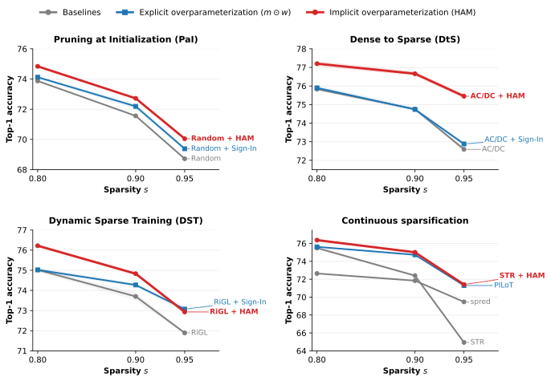
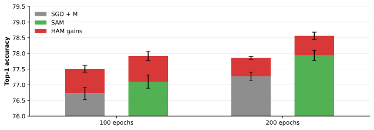

# Hyperbolic Aware Minimization: Implicit Bias for Sparsity

[](https://arxiv.org/abs/2506.02630)
[](https://openreview.net/forum?id=XKB5Hu0ACY)
 
*Tom Jacobs, Advait Gadhikar, Celia Rubio-Madrigal, Rebekka Burkholz*


An optimizer wrapper that adds a hyperbolic mirror step to any first-order optimizer, inducing mild sparsity and accelerating sign learning with negligible overhead.
- 🔀 **Sign acceleration** — faster learning around zero promotes parameter sign flips, improving feature learning
- 🌿 **Mild sparsity bias** — regularizes training; complementary to sharpness-aware methods (SAM)
 
HAM wraps any existing PyTorch optimizer (`Adam`, `SGD`, `AdamW`, …).
 
---
 
## What is HAM?
 
HAM (Hyperbolic Aware Minimization) addresses a key tension in sparse training: namely, that the optimizers bias is not aligned with the goal of sparsity. 

The overparameterization trick `m * w` induces a useful hyperbolic implicit bias towards sparsity [1,2,3], but shrinks the effective learning rate and slows convergence. HAM resolves this by **alternating** between a standard optimizer step and a lightweight hyperbolic mirror step. This preserves the beneficial geometry of `m * w` while keeping the learning rate larger and giving direct control over the strength and shape of the sparsity bias.

[[1]](https://openreview.net/forum?id=U47ymTS3ut) Jacobs & Burkholz. Mask in the Mirror: Implicit Sparsification. ICLR 2025.

[[2]](https://openreview.net/forum?id=MLiR9LS5PW) Jacobs, Zhou, Burkholz. Mirror, Mirror of the Flow: How Does Regularization Shape Implicit Bias?. ICML 2025. 

[[3]](https://openreview.net/forum?id=iwKT7MEZZw) Gadhikar*, Jacobs*, Zhou, Burkholz. Sign-In to the Lottery: Reparameterizing Sparse Training. NeurIPS 2025. 

 
---

## Optimizer Wrapper
```python
import torch

class HamOptimizerWrapper(torch.optim.Optimizer):
    def __init__(self, optimizer, alpha = 200, beta = 1e-3, max_weight_norm=1000.0, max_grad_norm=20.0):
         """Wraps any PyTorch optimizer with the HAM multiplicative update.
     
        After each base optimizer step, HAM rescales weight tensors (ndim >= 2)
        by an exponential factor derived from the gradient sign and a decay term:
     
            w  ←  w · exp(lr · (−α · sign(w) · ∇f(w)  −  β))
     
        This induces a mild implicit sparsity bias without zeroing weights.
        Scalar / bias / norm parameters are left untouched by the HAM step but
        still receive weight-norm and gradient-norm clipping.
     
        Args:
            optimizer:       Any instantiated torch.optim.Optimizer.
            alpha (float):   Gradient-sign coupling strength.  Default: 200.
            beta (float):    Constant decay term.               Default: 1e-3.
            max_weight_norm: Per-tensor weight-norm clip value.  Default: 1000.
            max_grad_norm:   Per-group gradient-norm clip value. Default: 20.
        """
        self.optimizer = optimizer
        self.max_weight_norm = max_weight_norm
        self.max_grad_norm = max_grad_norm
        self.alpha = alpha
        self.beta = beta

    def __getattr__(self, name):
        """
        Delegate attribute access to the wrapped optimizer.
        """
        if name == "optimizer":  # Prevent infinite recursion
            return super().__getattr__(name)
        return getattr(self.optimizer, name)
    
    def step(self, closure=None):
        """Perform optimization step with NaN protection"""
        # Run original optimizer step
        self.optimizer.step(closure)
        
        nan_detected = False
        
        for group in self.optimizer.param_groups:
            for param in group['params']:
                if param.grad is None:
                    continue
                    
                # Check for NaNs in the current parameters and gradients
                if torch.isnan(param.data).any():
                    print(f"NaN detected in parameter data: shape={param.shape}")
                    nan_detected = True
                    continue
                    
                if torch.isnan(param.grad).any():
                    print(f"NaN detected in gradient: shape={param.shape}")
                    nan_detected = True
                    continue
                
                # Only apply HAM update to weights with more than 2 dimensions
                is_weight = len(param.shape) >= 2
                if is_weight:
                    # Store original param data for safety
                    orig_data = param.data.clone()
                    
                    alpha = self.alpha
                    beta = self.beta
                    lr = group['lr']
                    
                    # Calculate and check each term separately
                    sign_term = torch.sign(param.data)
                    base_exponent = -alpha * sign_term * param.grad - beta
                    
                    # Clamping to prevent extreme values
                    exponent = torch.clamp(base_exponent * lr, -5.0, 5.0)
                    
                    # Check intermediate values for NaN
                    if torch.isnan(exponent).any():
                        print("NaN detected in exponent calculation")
                        nan_detected = True
                        continue
                    
                    # Apply update with safety check
                    update_factor = torch.exp(exponent)
                    mask = (param.data != 0)
                    param.data[mask] = param.data[mask] * update_factor[mask]   
                    
                    # Check for NaNs after update and revert if needed
                    if torch.isnan(param.data).any():
                        print("NaN detected after parameter update - reverting")
                        param.data = orig_data
                        nan_detected = True
                        continue
                    
                # Apply weight norm clipping to every parameter, not only linear/conv layers, but also BN
                weight_norm = torch.norm(param.data)
                if weight_norm > self.max_weight_norm:
                    print(f"Weight norm {weight_norm:.4f} exceeds max_weight_norm {self.max_weight_norm:.4f}, clipping")
                    param.data = param.data * (self.max_weight_norm / weight_norm)
            
            torch.nn.utils.clip_grad_norm_(group['params'], max_norm=self.max_grad_norm)

    def zero_grad(self):
        """Clear gradients in the wrapped optimizer."""
        self.optimizer.zero_grad()
```

## Example use
1. Store wrapper class in XXX.py 
```python
from XXX import HamOptimizerWrapper

optimizer = HamOptimizerWrapper(optimizer, 200, 1e-3)
```

## Results

### Sparse methods
 
Dense-to-sparse training and pruning at initialization with HAM on ImageNet with ResNet-50 (top-1 accuracy):


 
| Pruning type | Method | s = 0.8 | s = 0.9 | s = 0.95 |
|---|---|---|---|---|
| **PaI** | Random | 73.87 (±0.06) | 71.56 (±0.03) | 68.72 (±0.05) |
| | Random + [Sign-In](https://openreview.net/forum?id=iwKT7MEZZw) | 74.12 (±0.09) | 72.19 (±0.18) | 69.38 (±0.10) |
| | Random + HAM (ours) | **74.84 (±0.09)** | **72.72 (±0.03)** | **70.05 (±0.06)** |
| **DtS** | [AC/DC](https://github.com/IST-DASLab/ACDC) | 75.83 (±0.02) | 74.75 (±0.02) | 72.59 (±0.11) |
| | AC/DC + Sign-In | 75.90 (±0.14) | 74.74 (±0.12) | 72.88 (±0.13) |
| | AC/DC + HAM (ours) | **77.20 (±0.14)** | **76.66 (±0.12)** | **75.45 (±0.13)** |
| **DST** | [RiGL](https://github.com/google-research/rigl) | 75.02 (±0.10) | 73.70 (±0.20) | 71.89 (±0.07) |
| | RiGL + Sign-In | 75.02 (±0.10) | 74.27 (±0.08) | **73.07 (±0.17)** |
| | RiGL + HAM (ours) | **76.22 (±0.07)** | **74.83 (±0.08)** | 72.93 (±0.10) |
| **Cont. spars.** | [spred](https://openreview.net/forum?id=880tEHqxzg) | 72.64 | 71.84 | 69.47 |
| | [PILoT](https://openreview.net/forum?id=U47ymTS3ut) | 75.62 | 74.73 | 71.30 |
| | [STR](https://github.com/RAIVNLab/STR) | 75.49 (±0.14) | 72.40 (±0.11) | 64.94 (±0.07) |
| | STR + HAM (ours) | **76.37 (±0.18)** | **75.01 (±0.02)** | **71.41 (±0.10)** |
 
### Dense training

HAM combines naturally with [SAM](https://arxiv.org/pdf/2010.01412) and dense training as well.
Dense training of ResNet-50 on ImageNet (top-1 accuracy):


 
| | 100 epochs | 200 epochs | + SAM, 100 epochs | + SAM, 200 epochs |
|---|---|---|---|---|
| Baseline | 76.72 (±0.19) | 77.27 (±0.13) | 77.10 (±0.21) | 77.94 (±0.16) |
| HAM (ours) | **77.51 (±0.11)** | **77.86 (±0.05)** | **77.92 (±0.15)** | **78.56 (±0.12)** |
 
---


## Citation
If you use HAM in your research or training pipeline, please cite:
 
```bibtex
@inproceedings{
jacobs2026hyperbolic,
title={Hyperbolic Aware Minimization: Implicit Bias for Sparsity},
author={Tom Jacobs and Advait Gadhikar and Celia Rubio-Madrigal and Rebekka Burkholz},
booktitle={The Fourteenth International Conference on Learning Representations},
year={2026},
url={https://openreview.net/forum?id=XKB5Hu0ACY}
}
```
 
---
